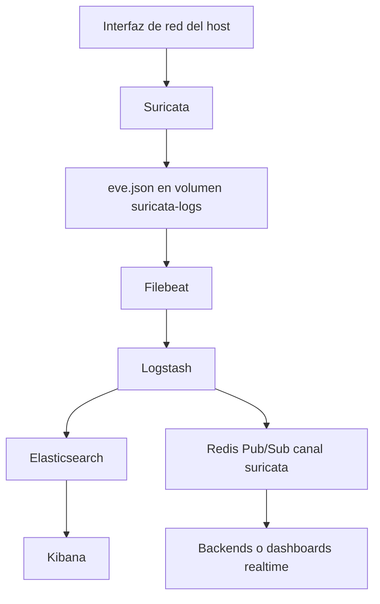

# Arquitectura

El proyecto implementa un sistema de monitoreo de red con dos salidas complementarias:

- Historica: eventos almacenados en Elasticsearch para busqueda y visualizacion en Kibana.
- Realtime: eventos publicados en Redis Pub/Sub para consumidores en vivo.

## Flujo principal

```text
Trafico del host
  -> Suricata
  -> eve.json
  -> Filebeat
  -> Logstash
  -> Elasticsearch -> Kibana
  -> Redis canal suricata -> backend/dashboard realtime
```

## Componentes

- Suricata inspecciona trafico y genera eventos EVE JSON en `/var/log/suricata/eve.json`.
- Filebeat lee `eve.json` con el modulo oficial de Suricata y envia los eventos a Logstash por Beats (`logstash:5044`).
- Logstash recibe los eventos y los publica en dos destinos: Elasticsearch y Redis.
- Elasticsearch guarda eventos en indices diarios `suricata-YYYY.MM.dd`.
- Kibana consulta Elasticsearch para exploracion historica.
- Redis publica eventos en el canal `suricata` para consumo inmediato.

## Diagrama



## Decisiones tecnicas

### Docker Compose

El stack se levanta con Compose para mantener una configuracion reproducible de servicios, volumenes, puertos y dependencias.

Archivos principales:

- `docker-compose.yml`: desarrollo/laboratorio.
- `docker-compose.prod.yml`: produccion basica con puertos publicados en `127.0.0.1`.

### Suricata en modo IPS por defecto

`.env.example` define `SURICATA_MODE=ips`. En este modo, el contenedor usa `NFQUEUE` para inspeccionar trafico saliente y permitir que reglas `reject` o `drop` bloqueen conexiones.

Tambien existe modo IDS:

```env
SURICATA_MODE=ids
SURICATA_INTERFACE=wlp0s20f3
```

IDS es captura pasiva por interfaz. IPS es bloqueo activo.

### Logstash como distribuidor

Filebeat solo permite un output activo. Como el proyecto necesita guardar historico en Elasticsearch y emitir eventos en tiempo real por Redis, Filebeat envia a Logstash y Logstash replica hacia ambos destinos.

### Redis Pub/Sub

Redis se usa como canal realtime, no como almacenamiento. Si no hay suscriptores conectados, los mensajes publicados se pierden. Elasticsearch sigue siendo la fuente historica.

### Elasticsearch single-node

Elasticsearch corre como nodo unico para reducir complejidad. Esto es suficiente para laboratorio y demos, pero no entrega alta disponibilidad.

## Puertos

Desarrollo:

- Elasticsearch: `localhost:9200`
- Kibana: `localhost:5601`
- Redis: `localhost:6379`

Produccion basica:

- Elasticsearch: `127.0.0.1:9200`
- Kibana: `127.0.0.1:5601`
- Redis: `127.0.0.1:6379`

Logstash escucha Beats dentro de la red Docker en el puerto `5044`; no se publica al host.

## Volumenes

- `suricata-logs`: contiene `eve.json` y logs de Suricata; lo comparten Suricata y Filebeat.
- `filebeat-data`: guarda offsets para evitar relecturas completas tras reinicios.
- `esdata`: datos indexados de Elasticsearch.
- `eslogs`: logs internos de Elasticsearch.

Redis no tiene volumen persistente porque se usa solo para Pub/Sub.

## Riesgos conocidos

- Suricata requiere privilegios elevados y `network_mode: host`.
- IPS modifica reglas `iptables`/`ip6tables` mientras el contenedor esta activo.
- Elasticsearch, Kibana y Redis no tienen autenticacion en la configuracion actual.
- Elasticsearch corre en single-node.
- Redis Pub/Sub no persiste mensajes.
- `SURICATA_INTERFACE` debe coincidir con interfaces reales cuando se usa modo IDS.

## Mejoras futuras

- Habilitar seguridad de Elastic con usuarios, contrasenas y TLS.
- Agregar autenticacion a Redis o restringirlo completamente a red interna.
- Definir politicas de retencion y backup para Elasticsearch.
- Agregar monitoreo de salud y recursos.
- Enriquecer eventos en Logstash, por ejemplo GeoIP o normalizacion de campos.
