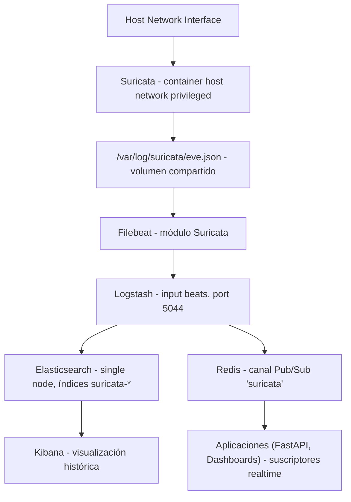

# Arquitectura del Stack

## Vista general

El sistema implementa un **pipeline dual** de Network Security Monitoring:

1. **Pipeline Histórico**: Persiste eventos en Elasticsearch para análisis retrospectivo, búsqueda y visualización en Kibana.
2. **Pipeline Realtime**: Distribuye eventos en tiempo real a través de Redis Pub/Sub para consumo inmediato en dashboards y backends.

Flujo end-to-end:

1. Suricata captura paquetes de una interfaz del host.
2. Suricata escribe eventos EVE JSON en `eve.json`.
3. Filebeat consume `eve.json` y lo parsea con el módulo de Suricata.
4. Filebeat envía documentos a Logstash (puerto 5044).
5. Logstash recibe eventos y los distribuye:
   - A Elasticsearch para almacenamiento histórico
   - A Redis para consumo realtime
6. Kibana consulta Elasticsearch para exploración y visualización.
7. Aplicaciones (backend FastAPI, dashboards) se suscriben a Redis canal `suricata` para eventos en vivo.

## Diagrama logico



## Decisiones tecnicas actuales

### 1) Docker Compose como orquestador

Se usa Compose para levantar servicios con una sola definicion versionada y reproducible, con volumenes persistentes y dependencias entre servicios.

### 2) Suricata en `network_mode: host`

Se usa host networking para captura real de paquetes del host. En modo bridge, el contenedor no ve el trafico del host de forma equivalente.

### 3) Volumen compartido para logs de Suricata
Logstash como multiplexer

**Problema**: Filebeat solo permite UN output. Se necesitaban dos destinos simultáneamente.

**Solución**: Logstash recibe eventos de Filebeat y distribuye a múltiples outputs (Elasticsearch + Redis).

**Alternativas rechazadas**:
- Ejecutar dos instancias de Filebeat → duplicación innecesaria
- Elegir un solo destino → pérdida de capacidad histórica o realtime

Logstash es la solución estándar de Elastic para este tipo de distribución.

### 5) Elasticsearch en single-node
Elasticsearch debe estar sano (healthcheck OK) antes de que Logstash inicie
- Logstash debe estar corriendo antes de que Filebeat se conecte
- Kibana depende de Elasticsearch sano (healthcheck OK)
- Suricata inicia independiente, capturando desde la interfaz definida en `.env`
- Redis inicia independiente, esperando suscriptores

Orden de inicio típico (automático en Compose):

```
1. redis
2. elasticsearch (espera a healthcheck)
3. logstash (depende de elasticsearch healthy)
4. filebeat (depende de logstash started)
5. suricata (independiente)
6. kibana (depende de elasticsearch healthy)
```
### 6) Redis Pub/Sub para realtime

**Canal vs. List**:
- **Channel** (Pub/Sub): sin persistencia, latencia mínima (~1ms), ideal para eventos en vivo
- **List**: persistencia, latencia ~1ms, ideal para queue/buffer durable

Se eligió **Channel** porque los eventos ya se persisten en Elasticsearch, y se necesita latencia mínima para dashboards realtime.

### 7
Configuracion enfocada en laboratorio y aprendizaje. Simplifica operacion, pero no representa alta disponibilidad.
 en Elasticsearch
- `eslogs`: logs internos de Elasticsearch
- `filebeat-data`: estado de lectura de Filebeat (offsets)
- `suricata-logs`: `eve.json` y otros logs de Suricata
- Redis: en memoria, sin volumen persistente (datos se pierden al reiniciar)educir friccion inicial. No es una configuracion recomendada para produccion.

## Dependencias de arranque

- Redis sin autenticacion y Pub/Sub sin persistencia
- Dependencia fuerte de la interfaz de red configurada
- Requiere permisos elevados para captura con Suricata
- Ajustes de kernel/memoria pueden ser necesarios en Linux
- Si Redis se reinicia, suscriptores pierden conexión y eventos en tránsito desaparecenaz definida en `.env`.

## Persistencia

- `esdata`: datos indexados.
- `eslogs`: logs internos de Elasticsearch.
- `filebeat-data`: estado de lectura de Filebeat.
- `suricata-logs`: `eve.json` y otros logs de Suricata.

## Riesgos conocidos

- Exposicion de puertos 9200 y 5601 sin autenticacion.
- Dependencia fuerte de la interfaz de red configurada.
- Requiere permisos elevados para captura con Suricata.
- Ajustes de kernel/memoria pueden ser necesarios en Linux.
 y agregar autenticacion en Redis
2. Restringir puertos con firewall o bind a localhost
3. Agregar monitoreo y alertas sobre salud del stack (Elasticsearch, Logstash, Redis)
4. Integrar backend (ej. FastAPI) para consultas controladas y consumo de eventos realtime
5. Persistencia opcional en Redis con estructura List para eventos críticos que requieran garantía de entrega
6. Enriquecimiento de eventos en Logstash (GeoIP, conversión de campos) para mejor análisis
2. Restringir puertos con firewall o bind a localhost.
3. Agregar monitoreo y alertas sobre salud del stack.
4. Integrar backend (ej. FastAPI) para consultas controladas.
