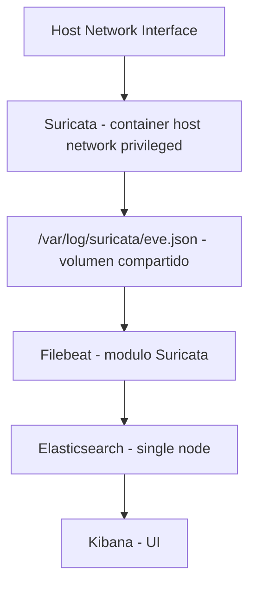

# Arquitectura del Stack

## Vista general

El sistema implementa un pipeline de Network Security Monitoring donde el trafico de red se transforma en eventos estructurados para analisis.

Flujo end-to-end:

1. Suricata captura paquetes de una interfaz del host.
2. Suricata escribe eventos EVE JSON en `eve.json`.
3. Filebeat consume `eve.json` y lo parsea con el modulo de Suricata.
4. Filebeat envia documentos a Elasticsearch.
5. Kibana consulta Elasticsearch para exploracion y visualizacion.

## Diagrama logico

## Decisiones tecnicas actuales

### 1) Docker Compose como orquestador

Se usa Compose para levantar servicios con una sola definicion versionada y reproducible, con volumenes persistentes y dependencias entre servicios.

### 2) Suricata en `network_mode: host`

Se usa host networking para captura real de paquetes del host. En modo bridge, el contenedor no ve el trafico del host de forma equivalente.

### 3) Volumen compartido para logs de Suricata

`suricata-logs` desacopla productor (Suricata) y consumidor (Filebeat), permitiendo reinicios independientes de servicios.

### 4) Elasticsearch en single-node

Configuracion enfocada en laboratorio y aprendizaje. Simplifica operacion, pero no representa alta disponibilidad.

### 5) Seguridad xpack deshabilitada

Se desactiva autenticacion para simplificar pruebas y reducir friccion inicial. No es una configuracion recomendada para produccion.

## Dependencias de arranque

- Kibana depende de Elasticsearch sano (healthcheck OK).
- Filebeat depende de Elasticsearch sano, y de que Kibana/Suricata hayan iniciado.
- Suricata inicia independiente, capturando desde la interfaz definida en `.env`.

## Persistencia

- `esdata`: datos indexados.
- `eslogs`: logs internos de Elasticsearch.
- `filebeat-data`: estado de lectura de Filebeat.
- `suricata-logs`: `eve.json` y otros logs de Suricata.

## Riesgos conocidos

- Exposicion de puertos 9200 y 5601 sin autenticacion.
- Dependencia fuerte de la interfaz de red configurada.
- Requiere permisos elevados para captura con Suricata.
- Ajustes de kernel/memoria pueden ser necesarios en Linux.

## Evolucion recomendada

1. Activar seguridad en Elasticsearch/Kibana.
2. Restringir puertos con firewall o bind a localhost.
3. Agregar monitoreo y alertas sobre salud del stack.
4. Integrar backend (ej. FastAPI) para consultas controladas.
