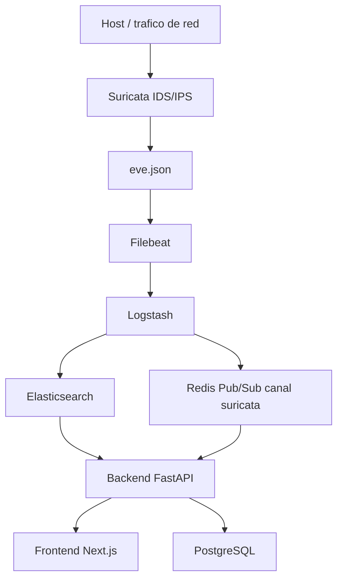

# Arquitectura

El proyecto implementa monitoreo de red con dos rutas complementarias:

- Historica: eventos persistidos en Elasticsearch para consultas y analytics.
- Realtime: eventos publicados por Redis Pub/Sub y retransmitidos al frontend por WebSocket.

## Flujo Principal

```mermaid
flowchart TD
    A[Host / trafico de red] --> B[Suricata IDS/IPS]
    B --> C[eve.json]
    C --> D[Filebeat]
    D --> E[Logstash]
    E --> F[Elasticsearch]
    E --> G[Redis Pub/Sub canal suricata]
    F --> H[Backend FastAPI]
    G --> H
    H --> I[Frontend Next.js]
    H --> J[PostgreSQL]
```

Para el detalle de rutas historica/realtime, endpoints y consumo frontend, ver [Flujo del proyecto, backend y frontend](Flujo-y-Backend.md).

## Componentes

| Componente | Responsabilidad | Documento |
| --- | --- | --- |
| Suricata | Captura/inspeccion IDS/IPS y genera EVE JSON. | [Suricata](../02-Componentes/Suricata.md) |
| Filebeat | Lee `eve.json` y envia eventos a Logstash. | [Filebeat](../02-Componentes/Filebeat.md) |
| Logstash | Replica eventos hacia Elasticsearch y Redis. | [Logstash](../02-Componentes/Logstash.md) |
| Elasticsearch | Almacena historico en indices diarios. | [Elasticsearch](../02-Componentes/Elasticsearch.md) |
| Redis | Canal realtime sin persistencia. | [Redis](../02-Componentes/Redis.md) |
| Backend FastAPI | Auth, API, WebSocket, enriquecimiento y gestion Suricata. | [API](../02-Componentes/backend/API.md) |
| PostgreSQL | Usuarios, roles, perfiles, reglas y configuracion administrativa. | [PostgreSQL y Auth](../02-Componentes/PostgreSQL-Auth.md) |
| Frontend Next.js | Dashboards, panel Suricata y consumo REST/WebSocket. | [Flujo backend/frontend](Flujo-y-Backend.md) |

## Decisiones Tecnicas

### Docker Compose

El stack usa Compose para reproducir servicios, volumenes, red y dependencias.

- `docker-compose.yml`: desarrollo/laboratorio.
- `docker-compose.prod.yml`: produccion basica con puertos restringidos a `127.0.0.1`.

### IPS Por Defecto

`.env.example` define `SURICATA_MODE=ips`. En este modo Suricata usa NFQUEUE para inspeccionar trafico saliente y permitir bloqueo con reglas `drop` o `reject`.

El modo IDS queda disponible para captura pasiva por interfaz. Variables completas en [Variables de entorno](../05-Referencia/Variables-Entorno.md).

### Logstash Como Distribuidor

Filebeat solo permite un output activo. Logstash centraliza la entrada Beats y replica hacia Elasticsearch para historico y Redis para baja latencia.

### Redis Solo Realtime

Redis no es fuente de verdad. Si no hay suscriptores, Pub/Sub pierde el mensaje. Elasticsearch conserva el historico.

### Elasticsearch Single-Node

La configuracion single-node reduce complejidad para laboratorio y demos, pero no ofrece alta disponibilidad.

## Puertos Y Volumenes

Puertos, variables, comandos de validacion y modo produccion estan centralizados en:

- [Variables de entorno](../05-Referencia/Variables-Entorno.md)
- [Comandos](../05-Referencia/Comandos.md)
- [Levantamiento en desarrollo](../03-Operacion/Levantamiento-Desarrollo.md)
- [Levantamiento en produccion](../03-Operacion/Levantamiento-Produccion.md)

Volumenes persistentes principales:

- `suricata-logs`: `eve.json` y logs compartidos con Filebeat.
- `suricata-rules`: reglas runtime generadas por `suricata-update`.
- `filebeat-data`: offsets de lectura.
- `esdata` y `eslogs`: datos y logs de Elasticsearch.
- `postgres-data`: usuarios, roles y configuracion administrativa.

Redis no tiene volumen porque solo se usa para Pub/Sub.

## Riesgos

Los riesgos y hardening recomendado estan en [Seguridad](../05-Referencia/Seguridad.md).
