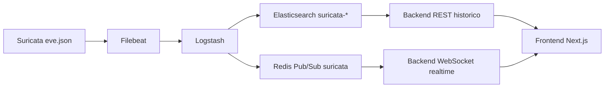

# Flujo Del Proyecto, Backend Y Frontend

Este documento explica como se separan persistencia, realtime, backend y frontend. Para la vista global de componentes, ver [Arquitectura](Arquitectura.md).

## Rutas De Datos

## Persistencia

- Logstash indexa eventos en `suricata-YYYY.MM.dd`.
- El backend consulta Elasticsearch desde `/api/events/*` y `/api/analytics/*`.
- Las vistas `/historical`, `/blocked`, `/geo` y `/rankings` muestran datos historicos.
- Los eventos enriquecidos pueden persistirse en `suricata-enriched-YYYY.MM.dd`, fuente de `/api/analytics/geo`.

## Realtime

- Logstash publica cada evento en Redis Pub/Sub, canal `suricata`.
- El backend mantiene suscripcion a Redis, normaliza/enriquece y reenvia por `WS /ws`.
- La vista `/live` consume WebSocket para eventos, contadores, mapa y exportacion CSV.
- Redis no persiste mensajes; si no hay suscriptor activo, el evento no queda en Redis.

## Backend

Capas principales:

- Auth y permisos: PostgreSQL, JWT en cookie HttpOnly, CSRF para mutaciones.
- Historico: consultas Elasticsearch.
- Realtime: Redis Pub/Sub hacia WebSocket.
- Normalizacion: formato comun para eventos crudos.
- Enriquecimiento: DNS reverso, GeoIP y AbuseIPDB.
- Notificaciones: Telegram para reglas custom u overrides con `notify_enabled`.
- Gestion Suricata: perfiles, fuentes, overrides, reglas custom y apply jobs.

Referencia completa de contratos y permisos: [API del backend](../02-Componentes/backend/API.md).

## Frontend

- Aplicacion Next.js en `frontend/`.
- Servicio Compose `frontend`, puerto `3000`.
- REST autenticado mediante cookies HttpOnly emitidas por el backend.
- WebSocket configurado con `NEXT_PUBLIC_WS_URL`.

Rutas principales:

| Ruta | Fuente principal | Uso |
| --- | --- | --- |
| `/live` | WebSocket | Actividad en vivo, eventos recientes, mapa y CSV. |
| `/historical` | REST analytics | KPIs y timeline historico. |
| `/blocked` | REST analytics | Bloqueos IPS. |
| `/geo` | `suricata-enriched-*` | Mapa y ranking geografico. |
| `/rankings` | REST analytics | Top IPs y firmas. |
| `/suricata` | REST gestion | Operacion de perfiles, reglas y notificaciones. |

Variables frontend en [Variables de entorno](../05-Referencia/Variables-Entorno.md).

## Regla De Lectura De Datos

- `Actividad en vivo`: Redis/WebSocket, baja latencia, no persistente.
- `Historico Elasticsearch`: REST/Elasticsearch, persistente, consultable por rango y filtros.

La UI debe distinguir ambas fuentes para no mezclar semanticas.
