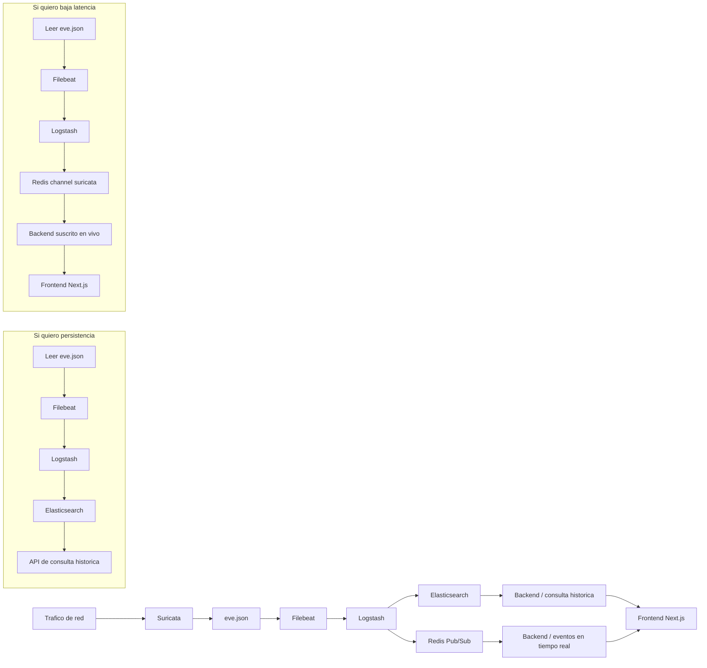

# Flujo del proyecto y backend

## Vista general

## Que significa cada ruta

### Si quiero persistencia, tengo que implementar esto de esta manera

- Mantener Elasticsearch como fuente historica.
- Guardar los eventos desde Logstash en indices diarios `suricata-YYYY.MM.dd`.
- Crear un backend que consulte Elasticsearch con filtros por fecha, tipo de evento, IP, puerto o severidad.
- Exponer endpoints como `GET /events/history`, `GET /events/search` y `GET /events/stats`.
- En el frontend Next.js, mostrar tablas, graficas y filtros sobre datos ya guardados.

### Si quiero baja latencia, tengo que hacer esto

- Consumir el canal `suricata` de Redis.
- Mantener una conexion abierta desde el backend hacia Redis Pub/Sub.
- Normalizar cada evento apenas llega y reenviarlo al front por WebSocket o Server-Sent Events.
- En el frontend Next.js, pintar una lista viva de ultimos eventos, alertas destacadas y contadores que cambian en segundos.
- Aceptar que esto no persiste mensajes: si no hay suscriptor activo, el evento se pierde para Redis.

## Como se piensa el backend

- Capa historica: consulta Elasticsearch y devuelve eventos persistidos.
- Capa en vivo: escucha Redis y retransmite eventos al front.
- Capa de normalizacion: convierte la salida cruda de Suricata en un formato comun para ambos modos.
- Capa de presentacion: una API REST para historico y un canal en tiempo real para el front.

## Frontend implementado

- Aplicacion Next.js en `frontend/`.
- Servicio Compose `frontend`, puerto `3000`.
- Consume `NEXT_PUBLIC_API_URL` y `NEXT_PUBLIC_WS_URL`.
- Incluye dashboard realtime con graficas, mapa, filtros, tabla de eventos y exportacion CSV.

## Resumen corto

- Persistencia: Elasticsearch + backend consultando indices.
- Baja latencia: Redis Pub/Sub + backend que empuja eventos al front.
- Ambos modos pueden convivir en el mismo backend si separas lectura historica y streaming en vivo.
