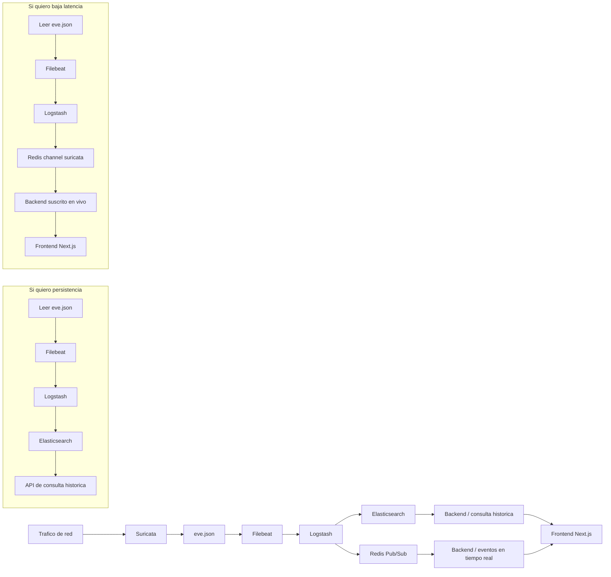

# Flujo del proyecto, backend y frontend

## Vista general



## Que significa cada ruta

### Si quiero persistencia, tengo que implementar esto de esta manera

- Mantener Elasticsearch como fuente historica.
- Guardar los eventos desde Logstash en indices diarios `suricata-YYYY.MM.dd`.
- Crear un backend que consulte Elasticsearch con filtros por fecha, tipo de evento, IP, puerto o severidad.
- Exponer endpoints historicos bajo `/api/events/*` y `/api/analytics/*`.
- En el frontend Next.js, mostrar tablas, graficas y filtros sobre datos ya guardados.

### Si quiero baja latencia, tengo que hacer esto

- Consumir el canal `suricata` de Redis.
- Mantener una conexion abierta desde el backend hacia Redis Pub/Sub.
- Normalizar cada evento apenas llega y reenviarlo al front por WebSocket o Server-Sent Events.
- En el frontend Next.js, pintar una lista viva de ultimos eventos, alertas destacadas y contadores que cambian en segundos.
- Aceptar que esto no persiste mensajes: si no hay suscriptor activo, el evento se pierde para Redis.

## Como se piensa el backend

- Capa historica: consulta Elasticsearch y devuelve eventos persistidos.
- Capa en vivo: escucha Redis y retransmite eventos al front.
- Capa de normalizacion: convierte la salida cruda de Suricata en un formato comun para ambos modos.
- Capa de enriquecimiento: agrega DNS reverso, GeoIP y reputacion AbuseIPDB.
- Capa de notificacion: envia Telegram para alertas cuyo `GID:SID` coincida con reglas custom u overrides marcados con `notify_enabled` en el perfil activo.
- Capa de presentacion: una API REST para historico y un canal en tiempo real para el front.

## Endpoints implementados

### Eventos

| Endpoint | Uso | Fuente |
| --- | --- | --- |
| `GET /api/events/health` | Salud del backend. | Backend |
| `GET /api/events/latest` | Eventos recientes con filtros `event_type` y `severity`. | `suricata-*` |
| `GET /api/events/stats` | Agregados basicos por tipo, severidad e IP origen. | `suricata-*` |
| `GET /api/events/search` | Busqueda full-text sobre `event.original`. | `suricata-*` |

`/api/events/health` es publico. Los demas endpoints requieren sesion valida con rol `admin`, `analyst` o `viewer`.

### Analytics

| Endpoint | Uso | Frontend | Fuente |
| --- | --- | --- | --- |
| `GET /api/analytics/overview?hours=24` | KPIs generales: eventos, alertas, bloqueos, IPs unicas, severidad. | `/historical` | `suricata-*` |
| `GET /api/analytics/timeline?hours=24&interval=5m` | Serie temporal de eventos, alertas, bloqueos y criticidad. | `/historical` | `suricata-*` |
| `GET /api/analytics/top-ips?hours=24&direction=source&size=10` | Ranking de IPs origen o destino. | `/rankings` | `suricata-*` |
| `GET /api/analytics/top-signatures?hours=24&size=10` | Ranking de firmas Suricata. | `/rankings` | `suricata-*` |
| `GET /api/analytics/blocked?hours=24&size=10` | Resumen de reglas de bloqueo IPS. | `/blocked` | `suricata-*` |
| `GET /api/analytics/geo?hours=24&direction=both&event_type=all&min_count=1` | Mapa historico y rankings geograficos. | `/geo` | `suricata-enriched-*` |

Filtros principales:

- `hours`: rango historico entre 1 y 168 horas.
- `size`: cantidad de resultados para rankings.
- `direction`: `source`, `destination` o `both` para geografia.
- `event_type`: `all`, `alert`, `dns`, `http` o `tls` para geografia.
- `only_blocked`: limita geografia a firmas de bloqueo.
- `only_malicious`: limita geografia a eventos marcados como maliciosos.
- `min_count`: cantidad minima de eventos por punto geografico.

`/api/analytics/geo` consulta documentos enriquecidos persistidos en `suricata-enriched-*`. No usa muestras recientes ni vuelve a enriquecer eventos crudos en cada consulta.

### Realtime

| Endpoint | Uso | Fuente |
| --- | --- | --- |
| `WS /ws` | Eventos en tiempo real desde Redis Pub/Sub. | Canal Redis `suricata` |

El WebSocket requiere cookie HttpOnly `suricata_session`, `Origin` permitido por `BACKEND_CORS_ALLOWED_ORIGINS` y rol `admin`, `analyst` o `viewer`.

Query params soportados:

- `event_types`: tipos separados por coma, por ejemplo `alert,http,dns`.
- `min_severity`: severidad minima, donde `1` es critica y `4` baja.

El cliente tambien puede enviar mensajes `ping` y `filter` para heartbeat y ajuste de filtros durante la conexion.

### Auth y gestion

- `POST /api/auth/login`: emite cookies `suricata_session` y `suricata_csrf`.
- `POST /api/auth/logout`: revoca la sesion actual mediante `token_version`.
- `GET /api/auth/me`: devuelve el usuario autenticado.
- `GET/POST/PATCH/DELETE /api/auth/users`: administracion de usuarios, solo `admin`.
- `GET/PATCH/POST/DELETE /api/suricata/*`: gestion de perfiles, fuentes, overrides, reglas custom, apply jobs y notificaciones.

Las mutaciones protegidas requieren header `X-CSRF-Token` con el valor de la cookie `suricata_csrf`.

## Enriquecimiento y notificaciones

Cada evento que llega por Redis se procesa antes de retransmitirse por WebSocket:

- `_resolved.source_hostname` y `_resolved.dest_hostname`: DNS reverso con cache de 1 hora.
- `_geo.source` y `_geo.destination`: pais, ciudad, coordenadas e ISP desde GeoLite2 o fallback `ip-api.com`.
- `_threat`: reputacion AbuseIPDB para IP origen cuando `BACKEND_ABUSEIPDB_KEY` esta configurada, con cache de 24 horas.

Si `BACKEND_ENRICHED_INDEX_ENABLED=true`, el backend persiste una copia enriquecida en `suricata-enriched-YYYY.MM.dd`. Ese indice es la fuente de `/api/analytics/geo`.

Telegram se envia solo si:

- `BACKEND_TELEGRAM_BOT_TOKEN` esta configurado.
- La configuracion global en `suricata_notification_settings` tiene `telegram_enabled=true`.
- Existe al menos un destinatario en `telegram_chat_recipients`.
- El evento recibido es `event_type=alert`.
- El `GID:SID` coincide con una regla custom u override marcado con `notify_enabled=true` en el perfil activo.

## Frontend implementado

- Aplicacion Next.js en `frontend/`.
- Servicio Compose `frontend`, puerto `3000`.
- Consume `NEXT_PUBLIC_API_URL` y `NEXT_PUBLIC_WS_URL`.
- Usa `authenticatedFetch` para REST autenticado y cookies HttpOnly emitidas por el backend.
- `/live`: dashboard realtime con graficas, mapa, filtros, tabla de eventos y exportacion CSV.
- `/historical`: KPIs y timeline historico.
- `/blocked`: bloqueos IPS.
- `/geo`: mapa y rankings geograficos.
- `/rankings`: top IPs y firmas.
- `/suricata`: gestion operativa para roles `admin` y `analyst`.

La ruta `/` redirige a `/live`. Las vistas de dashboard requieren login. Los datos live y los historicos deben presentarse con etiquetas claras para no mezclar semanticas: `Actividad en vivo` usa WebSocket y `Historico Elasticsearch` usa `/api/analytics/*`.

Variables frontend:

```env
NEXT_PUBLIC_API_URL=http://localhost:8000
NEXT_PUBLIC_WS_URL=ws://localhost:8000/ws
```

## Resumen corto

- Persistencia: Elasticsearch + backend consultando indices.
- Baja latencia: Redis Pub/Sub + backend que empuja eventos al front.
- Ambos modos pueden convivir en el mismo backend si separas lectura historica y streaming en vivo.
