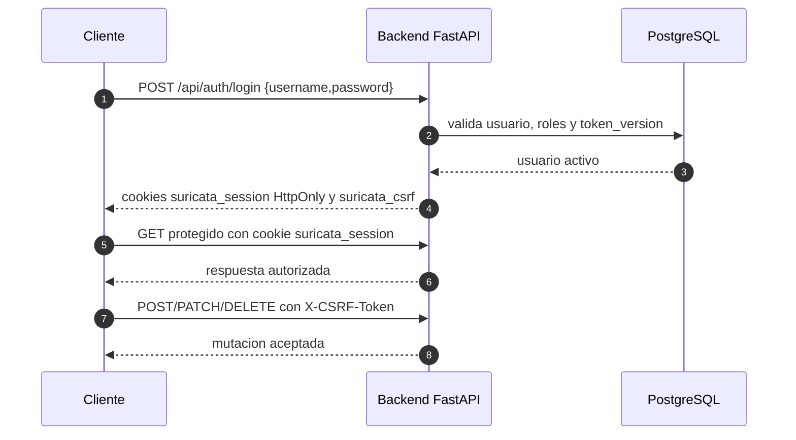
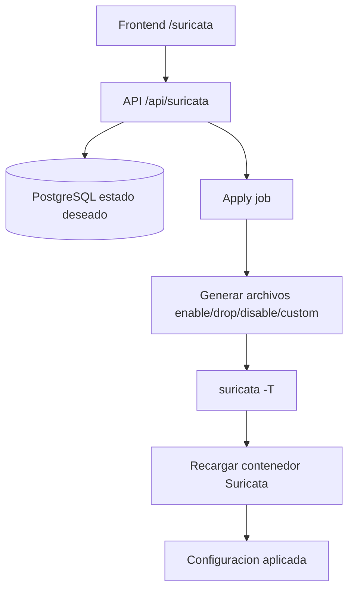

# API Del Backend

Referencia operativa de la API FastAPI expuesta por el servicio `backend` en `http://localhost:8000`.

La documentación interactiva generada por FastAPI queda disponible en:

```text
http://localhost:8000/docs
```

## Flujo De Autenticacion



## Reglas Generales

- Base URL desarrollo: `http://localhost:8000`.
- Base URL produccion basica: `http://127.0.0.1:8000`.
- Los endpoints publicos son `GET /` y `GET /api/events/health`.
- Los endpoints protegidos requieren la cookie HttpOnly `suricata_session`.
- Las mutaciones protegidas requieren header `X-CSRF-Token` con el valor de la cookie `suricata_csrf`.
- Roles de lectura general: `admin`, `analyst`, `viewer`.
- Roles de gestion Suricata: `admin` y `analyst` para mutaciones.
- Gestion de usuarios: solo `admin`.

## Login Por Consola

Usar [Auth por consola](../../05-Referencia/Comandos.md#auth-por-consola). Para mutaciones, extraer `CSRF` como se indica en [Comandos](../../05-Referencia/Comandos.md#auth-por-consola).

## Raiz Y Salud

| Metodo | Endpoint | Auth | Uso |
| --- | --- | --- | --- |
| `GET` | `/` | No | Estado general, Redis y ruta WebSocket. |
| `GET` | `/api/events/health` | No | Health check del backend. |

Ejemplo:

```bash
curl http://localhost:8000/
curl http://localhost:8000/api/events/health
```

## Auth

| Metodo | Endpoint | Roles | CSRF | Uso |
| --- | --- | --- | --- | --- |
| `POST` | `/api/auth/login` | Publico | No | Inicia sesion y emite cookies. |
| `POST` | `/api/auth/logout` | Usuario autenticado | Si | Revoca la sesion actual por `token_version`. |
| `GET` | `/api/auth/me` | Usuario autenticado | No | Devuelve el usuario actual. |
| `GET` | `/api/auth/users` | `admin` | No | Lista usuarios. |
| `POST` | `/api/auth/users` | `admin` | Si | Crea usuario. |
| `PATCH` | `/api/auth/users/{user_id}` | `admin` | Si | Actualiza usuario, roles, password o estado. |
| `DELETE` | `/api/auth/users/{user_id}` | `admin` | Si | Desactiva usuario. |

Ejemplos:

```bash
curl -b cookies.txt http://localhost:8000/api/auth/me

curl -b cookies.txt -X POST http://localhost:8000/api/auth/logout \
  -H "X-CSRF-Token: $CSRF"
```

Crear usuario:

```bash
curl -b cookies.txt -X POST http://localhost:8000/api/auth/users \
  -H "Content-Type: application/json" \
  -H "X-CSRF-Token: $CSRF" \
  -d '{"username":"analista","email":"analista@example.com","password":"password123","roles":["analyst"],"is_active":true}'
```

## Eventos

Fuente historica: indices `suricata-*` en Elasticsearch.

| Metodo | Endpoint | Roles | Parametros | Uso |
| --- | --- | --- | --- | --- |
| `GET` | `/api/events/latest` | `admin`, `analyst`, `viewer` | `limit`, `event_type`, `severity` | Ultimos eventos. |
| `GET` | `/api/events/stats` | `admin`, `analyst`, `viewer` | `hours` | Agregados basicos. |
| `GET` | `/api/events/search` | `admin`, `analyst`, `viewer` | `query`, `limit`, `offset` | Busqueda full-text. |

Restricciones principales:

- `limit`: 1 a 100.
- `severity`: 1 a 4.
- `hours`: 1 a 168.

Ejemplos:

```bash
curl -b cookies.txt 'http://localhost:8000/api/events/latest?limit=10&event_type=alert'
curl -b cookies.txt 'http://localhost:8000/api/events/stats?hours=24'
curl -b cookies.txt 'http://localhost:8000/api/events/search?query=BLOQUEO&limit=20&offset=0'
```

## Analytics

Fuente historica general: `suricata-*`. Fuente geografica enriquecida: `suricata-enriched-*`.

| Metodo | Endpoint | Parametros | Frontend | Uso |
| --- | --- | --- | --- | --- |
| `GET` | `/api/analytics/overview` | `hours` | `/historical` | KPIs generales. |
| `GET` | `/api/analytics/timeline` | `hours`, `interval` | `/historical` | Serie temporal. |
| `GET` | `/api/analytics/top-ips` | `hours`, `direction`, `size` | `/rankings` | Ranking de IPs. |
| `GET` | `/api/analytics/top-signatures` | `hours`, `size` | `/rankings` | Ranking de firmas. |
| `GET` | `/api/analytics/blocked` | `hours`, `size` | `/blocked` | Bloqueos IPS. |
| `GET` | `/api/analytics/geo` | `hours`, `direction`, `event_type`, `only_blocked`, `only_malicious`, `min_count` | `/geo` | Agregacion geografica. |

Valores admitidos:

- `hours`: 1 a 168.
- `interval`: formato como `5m`, `1h` o `1d`.
- `direction` para top IPs: `source` o `destination`.
- `direction` para geo: `source`, `destination` o `both`.
- `event_type` para geo: `all`, `alert`, `dns`, `http` o `tls`.
- `size`: 1 a 50.

Ejemplos:

```bash
curl -b cookies.txt 'http://localhost:8000/api/analytics/overview?hours=24'
curl -b cookies.txt 'http://localhost:8000/api/analytics/timeline?hours=24&interval=5m'
curl -b cookies.txt 'http://localhost:8000/api/analytics/top-ips?hours=24&direction=source&size=10'
curl -b cookies.txt 'http://localhost:8000/api/analytics/geo?hours=24&direction=both&event_type=all&min_count=1'
```

## Gestion Suricata



| Metodo | Endpoint | Roles | CSRF | Uso |
| --- | --- | --- | --- | --- |
| `GET` | `/api/suricata/status` | `admin`, `analyst`, `viewer` | No | Estado del contenedor, perfil activo y ultimo job. |
| `GET` | `/api/suricata/profiles` | `admin`, `analyst`, `viewer` | No | Lista perfiles. |
| `POST` | `/api/suricata/profiles` | `admin`, `analyst` | Si | Crea perfil. |
| `PATCH` | `/api/suricata/profiles/{profile_id}` | `admin`, `analyst` | Si | Edita perfil. |
| `DELETE` | `/api/suricata/profiles/{profile_id}` | `admin`, `analyst` | Si | Elimina perfil no activo. |
| `POST` | `/api/suricata/profiles/{profile_id}/activate` | `admin`, `analyst` | Si | Activa perfil. |
| `GET` | `/api/suricata/sources` | `admin`, `analyst`, `viewer` | No | Lista fuentes externas. |
| `PATCH` | `/api/suricata/sources/{source_id}` | `admin`, `analyst` | Si | Activa o desactiva fuente. |
| `GET` | `/api/suricata/profiles/{profile_id}/rule-overrides` | `admin`, `analyst`, `viewer` | No | Lista overrides. |
| `POST` | `/api/suricata/profiles/{profile_id}/rule-overrides` | `admin`, `analyst` | Si | Crea override. |
| `PATCH` | `/api/suricata/rule-overrides/{override_id}` | `admin`, `analyst` | Si | Edita override. |
| `DELETE` | `/api/suricata/rule-overrides/{override_id}` | `admin`, `analyst` | Si | Elimina override. |
| `GET` | `/api/suricata/profiles/{profile_id}/custom-rules` | `admin`, `analyst`, `viewer` | No | Lista reglas custom. |
| `POST` | `/api/suricata/profiles/{profile_id}/custom-rules` | `admin`, `analyst` | Si | Crea regla custom. |
| `PATCH` | `/api/suricata/custom-rules/{rule_id}` | `admin`, `analyst` | Si | Edita regla custom. |
| `DELETE` | `/api/suricata/custom-rules/{rule_id}` | `admin`, `analyst` | Si | Elimina regla custom. |
| `POST` | `/api/suricata/custom-rules/validate` | `admin`, `analyst` | Si | Valida sintaxis basica de regla. |
| `POST` | `/api/suricata/apply` | `admin`, `analyst` | Si | Genera archivos, valida y recarga Suricata. |
| `GET` | `/api/suricata/apply-jobs/{job_id}` | `admin`, `analyst`, `viewer` | No | Consulta job de aplicacion. |
| `GET` | `/api/suricata/notification-settings` | `admin`, `analyst`, `viewer` | No | Lee configuracion Telegram. |
| `PATCH` | `/api/suricata/notification-settings` | `admin`, `analyst` | Si | Edita configuracion Telegram. |

Crear perfil:

```bash
curl -b cookies.txt -X POST http://localhost:8000/api/suricata/profiles \
  -H "Content-Type: application/json" \
  -H "X-CSRF-Token: $CSRF" \
  -d '{"name":"Perfil demo","description":"Perfil para evaluacion","mode":"IPS","sensitivity":"medium"}'
```

Aplicar perfil activo:

```bash
PROFILE_ID=$(curl -fsS -b cookies.txt http://localhost:8000/api/suricata/profiles \
  | python3 -c 'import json,sys; print(next(p["id"] for p in json.load(sys.stdin) if p.get("is_active")))')

curl -b cookies.txt -X POST http://localhost:8000/api/suricata/apply \
  -H "Content-Type: application/json" \
  -H "X-CSRF-Token: $CSRF" \
  -d "{\"profile_id\":\"$PROFILE_ID\"}"
```

## Listas Negras Y Blancas

Las listas usan PostgreSQL como estado deseado y se materializan como reglas locales del perfil seleccionado. `POST /api/lists/apply` sincroniza esas reglas y delega la aplicacion final al mismo flujo de jobs de Suricata.

| Metodo | Endpoint | Roles | CSRF | Uso |
| --- | --- | --- | --- | --- |
| `GET` | `/api/lists/block?profile_id={profile_id}` | `admin`, `analyst`, `viewer` | No | Lista entradas de blacklist del perfil. |
| `POST` | `/api/lists/block` | `admin`, `analyst` | Si | Crea entrada `domain`, `ip` o `cidr` con accion `drop` o `reject`. |
| `PATCH` | `/api/lists/block/{id}` | `admin`, `analyst` | Si | Edita entrada de blacklist. |
| `DELETE` | `/api/lists/block/{id}` | `admin`, `analyst` | Si | Elimina entrada y reglas generadas asociadas. |
| `GET` | `/api/lists/allow?profile_id={profile_id}` | `admin`, `analyst`, `viewer` | No | Lista entradas de allowlist del perfil. |
| `POST` | `/api/lists/allow` | `admin`, `analyst` | Si | Crea entrada `domain`, `ip` o `cidr` con accion `pass`. |
| `PATCH` | `/api/lists/allow/{id}` | `admin`, `analyst` | Si | Edita entrada de allowlist. |
| `DELETE` | `/api/lists/allow/{id}` | `admin`, `analyst` | Si | Elimina entrada y reglas generadas asociadas. |
| `GET` | `/api/lists/generated-rules?profile_id={profile_id}` | `admin`, `analyst`, `viewer` | No | Previsualiza reglas generadas para el perfil. |
| `POST` | `/api/lists/apply` | `admin`, `analyst` | Si | Sincroniza reglas de listas y ejecuta apply Suricata. |

Campos principales:

- `entry_type`: `domain`, `ip` o `cidr`.
- `direction`: `source`, `destination` o `both`; en dominios se normaliza a `destination`.
- Blacklist usa `drop` o `reject`; allowlist usa `pass`.
- La allowlist depende de la semantica de reglas `pass` de Suricata y no debe tratarse como bypass absoluto.

## WebSocket Realtime

Endpoint:

```text
ws://localhost:8000/ws
```

El WebSocket requiere:

- Cookie `suricata_session` valida.
- `Origin` permitido por `BACKEND_CORS_ALLOWED_ORIGINS`.
- Rol `admin`, `analyst` o `viewer`.

Query params:

| Parametro | Ejemplo | Uso |
| --- | --- | --- |
| `event_types` | `alert,http,dns` | Filtra tipos de evento. |
| `min_severity` | `2` | Severidad minima, donde 1 es critica. |

Mensajes cliente soportados:

```json
{"type":"ping"}
```

```json
{"type":"filter","event_types":["alert"],"min_severity":2,"keywords":["BLOQUEO"]}
```

Respuestas de control:

```json
{"type":"pong"}
```

```json
{"status":"filter_updated"}
```

## Codigos De Error Frecuentes

| Codigo | Causa usual | Accion |
| --- | --- | --- |
| `400` | Payload invalido, override duplicado o perfil activo eliminado. | Revisar JSON y estado actual. |
| `401` | Sin sesion o credenciales invalidas. | Repetir login. |
| `403` | Rol insuficiente o CSRF ausente. | Revisar rol y `X-CSRF-Token`. |
| `404` | Recurso inexistente. | Confirmar UUID. |
| `429` | Muchos intentos fallidos de login. | Esperar unos minutos. |
| `500` | Error interno o dependencia caida. | Revisar logs del backend. |

Logs utiles:

```bash
docker compose logs --tail=100 backend
```
