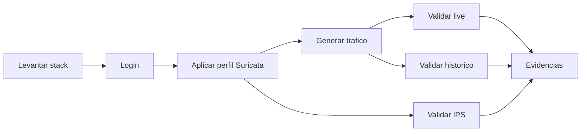

# Demo Y Evaluacion

Recorrido recomendado para presentar el proyecto y recolectar evidencia de funcionamiento.

## Objetivo

Demostrar captura Suricata, persistencia Elasticsearch, realtime Redis/WebSocket, enriquecimiento backend, dashboard frontend y gestion de reglas IPS.

## Flujo De La Demo



## 1. Levantar Stack

Usa [Levantamiento en desarrollo](Levantamiento-Desarrollo.md). Para comandos puntuales, ver [Comandos](../05-Referencia/Comandos.md).

Validacion minima:

```bash
docker compose ps
curl http://localhost:8000/api/events/health
curl http://localhost:9200/_cluster/health
docker exec redis redis-cli PING
```

## 2. Login

Abrir `http://localhost:3000/login`.

Credenciales bootstrap de laboratorio: `admin` / `admin123`. Si usaste `./scripts/dev-up.sh`, usa el admin creado durante el script.

## 3. Aplicar Perfil Suricata

Desde la UI:

1. Entrar a `/suricata`.
2. Confirmar estado del contenedor.
3. Presionar **Aplicar configuracion**.
4. Confirmar job `success`.

Por consola: [Aplicar perfil Suricata](../05-Referencia/Comandos.md#aplicar-perfil-suricata).

## 4. Generar Trafico

Usa trafico controlado:

```bash
ping -c 4 8.8.8.8
curl http://neverssl.com
curl http://example.com
```

Si existen reglas custom de bloqueo, generar trafico hacia esos dominios solo en laboratorio controlado.

## 5. Evidencia Realtime

Abrir `http://localhost:3000/live`.

Validar:

- WebSocket conectado.
- Tabla de eventos recientes.
- Graficas actualizandose.
- Mapa si hay geolocalizacion.
- Exportacion CSV si se requiere evidencia adicional.

Validacion Redis opcional: [Redis realtime](../05-Referencia/Comandos.md#redis-realtime).

## 6. Evidencia Historica

Abrir:

```text
http://localhost:3000/historical
http://localhost:3000/blocked
http://localhost:3000/geo
http://localhost:3000/rankings
```

Validar por API con [Eventos y analytics](../05-Referencia/Comandos.md#eventos-y-analytics).

## 7. Evidencia IPS

Validar NFQUEUE y reglas con [IPS y reglas](../05-Referencia/Comandos.md#ips-y-reglas).

Resultado esperado:

- Reglas `NFQUEUE` en `OUTPUT`.
- Archivo `suricata.rules` generado.
- Logs de Suricata sin errores persistentes.

## 8. Evidencias Recomendadas

- `docker compose ps` con servicios activos.
- `/login` y usuario autenticado.
- `/live` con eventos.
- `/historical` con KPIs.
- `/geo` con mapa.
- `/suricata` con estado y ultimo job.
- `iptables -L OUTPUT -n` mostrando `NFQUEUE`.

Capturas guardadas en este repositorio:

| Vista | Archivo |
| --- | --- |
| Login | [`../assets/screenshots/login.png`](../assets/screenshots/login.png) |
| Live | [`../assets/screenshots/live.png`](../assets/screenshots/live.png) |
| Historico | [`../assets/screenshots/historical.png`](../assets/screenshots/historical.png) |
| Geo | [`../assets/screenshots/geo.png`](../assets/screenshots/geo.png) |
| Panel Suricata | [`../assets/screenshots/suricata-panel.png`](../assets/screenshots/suricata-panel.png) |

Snapshots de accesibilidad guardados:

| Vista | Archivo |
| --- | --- |
| Live | [`../assets/snapshots/live.txt`](../assets/snapshots/live.txt) |
| Panel Suricata | [`../assets/snapshots/suricata-panel.txt`](../assets/snapshots/suricata-panel.txt) |

## 9. Cierre

```bash
docker compose down
```

Limpieza total de laboratorio, destructiva:

```bash
docker compose down -v
```
